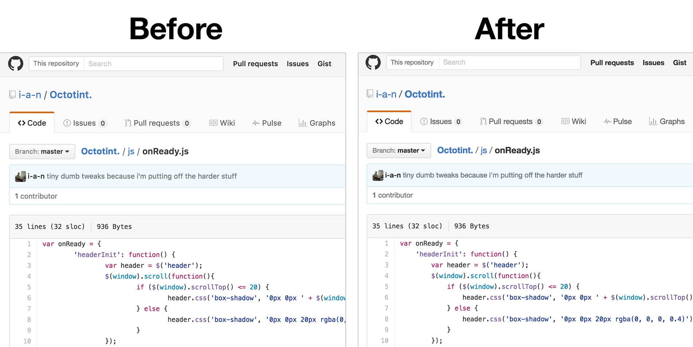

# GitHub Style Override

This is a tiny [Chrome extension](https://chrome.google.com/webstore/detail/fokbkibnoehgchghhgfhpglkfppffmmp/) that reverts GitHub.com's sans-serif font back to Helvetica. They changed it to "-webkit-default" in July of 2016 and, if you're the kind of person who noticed, you might be the kind of person who wants to change it back.

This extension also includes a feature that sets tabs in GitHub's code view to equal whatever number of spaces you want (default: 4). GitHub defaults to 8 which is pretty silly, I think.

## Install

Option 1: Just install from the [Google Web Store](https://chrome.google.com/webstore/detail/fokbkibnoehgchghhgfhpglkfppffmmp/)!

Option 2 (more advanced): You can also install the latest, unpacked version directly from this GitHub repo. Clone or download-and-unzip this repository, then click "load unpacked extension" in Google Chrome, and select the `github-style-override-chrome` directory you just downloaded. That's it! See [https://developer.chrome.com/extensions/getstarted#unpacked](https://developer.chrome.com/extensions/getstarted#unpacked) for step-by-step instructions on installing an unpacked extension, if you need them.

## Notes

- This is meant for Chrome running on Mac. Windows probably won't work (and won't display Helvetica anyway unless you went out and licensed it)
- I'll keep this updated indefinitely. GitHub on Mac+Chrome comprises a large part of my daily career activities and I can't look at [San Francisco](https://developer.apple.com/fonts/) all day
- Feel free to contribute. If you're the kind of person who noticed this stuff, you're probably the kind of person who will have good stuff to add
